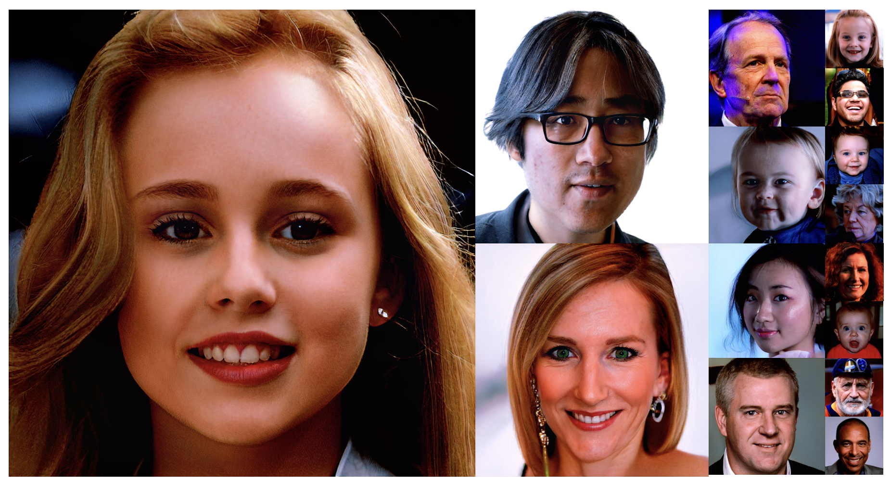

MindSpore版的StyleGAN2-ada，以及简单的反投影（使用ModelZoo的VGG16实现lpips loss）以及属性编辑



## 安装

```
conda install mindspore=2.1.0 -c mindspore -c conda-forge
pip install torch rich pretty_errors face_alignment dlib tqdm
```

+ 从[NVlabs/stylegan2-ada-pytorch: StyleGAN2-ADA - Official PyTorch implementation (github.com)](https://github.com/NVlabs/stylegan2-ada-pytorch)获取`stylegan2-ffhq-config-f.pkl`，放置到`./ckpt`下，运行`python 1.convert-to-mindspore.py`得到mindspore版的权重。
+ 从[official/cv/VGG/vgg16 · MindSpore/models - 码云 - 开源中国 (gitee.com)](https://gitee.com/mindspore/models/tree/master/official/cv/VGG/vgg16)获取`vgg16_bn_ascend_v170_imagenet2012_official_cv_top1acc74.33_top5acc92.1.ckpt`，改名为`vgg16.ckpt`，放置到`./ckpt`下。

## 运行

随机生成图片

```
python 2.generate-using-seeds.py
```

反投影图片（以obama.png为例）

```
3.project-real-image.py
```

## 说明

大量参考了[https://github.com/NVlabs/stylegan2-ada-pytorch](https://github.com/NVlabs/stylegan2-ada-pytorch)。

实现不完全正确，可能有精度问题，图像输出和torch版本相差较大，同时自定义算子都采用了最笨的实现方式，速度也慢许多。
